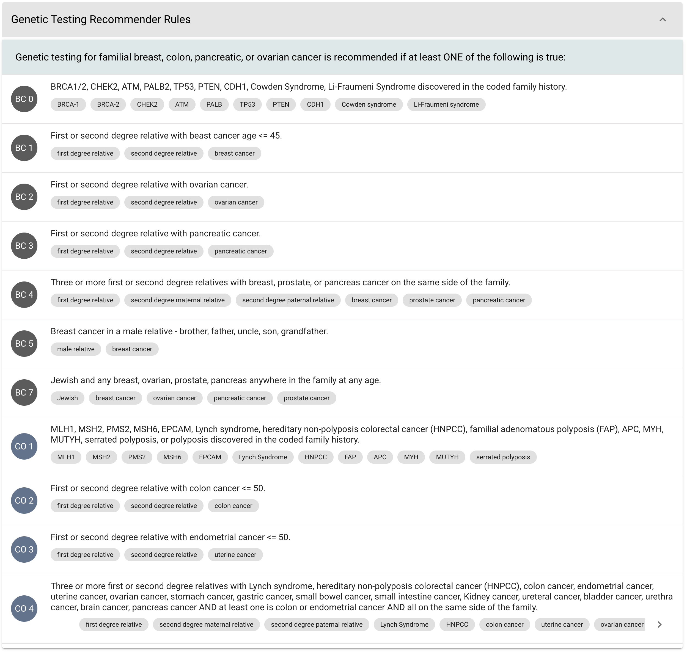
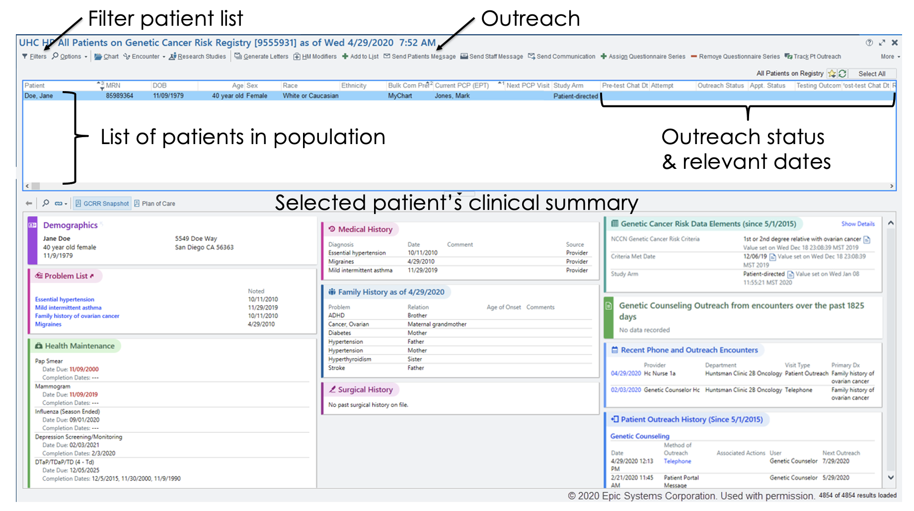
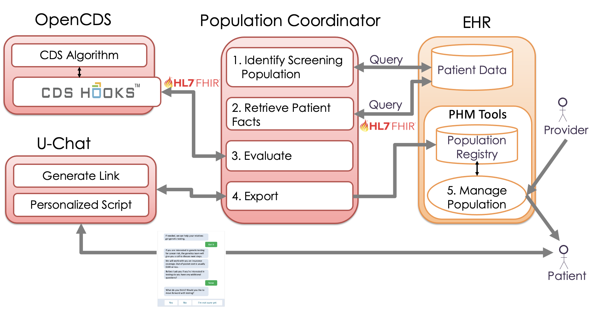
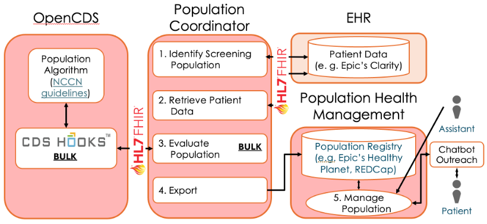

```{r, include = FALSE}
ottrpal::set_knitr_image_path()
```


# Architecture Overview

This chapter introduces GARDE’s purpose and architecture to help stake holders and decision makers understand how GARDE
components fit into the big picture from a clinical and technical perspective. By the end of the chapter readers should
understand 1) what GARDE is and why it was created, 2) the basic function and purpose of each architectural component,
3) which EHR components/tools are required, 4) where the EHR integration points are, 5) how GARDE interventions are
incorporated into clinical practice, 6) how GARDE benefits providers.

## Target Audience

This chapter is intended for cancer researchers, genetic counselors, or other leaders who desire to know more about
GARDE’s architecture and its implications.

## Introduction to GARDE

Increased evidence supports individualizing cancer screening based on risk, with selective application of specific
screening technologies best suited to the individual. However, individualizing screening at a population scale requires
the implementation of patient-specific risk assessments for several types of cancer. Such personalized screening is
challenging to achieve in today’s overwhelmed primary care settings. A promising solution to this problem is to automate
the identification and management of high-risk patients using electronic health record (EHR) technologies coupled with
advanced clinical decision support (CDS) tools.

CDS is considered a critical component for applying the latest research findings to patient care. With the Meaningful
Use incentive program, EHR adoption in the U.S. has risen to over 80%. This ecosystem provides a unique opportunity for
delivering effective CDS to patients and providers at a large scale. Despite supporting evidence and Federal incentives
towards CDS adoption, advanced and effective CDS is still not widely disseminated. Significant barriers to the
dissemination of effective CDS are still prevalent. In essence, the current CDS landscape consists largely of EHR
systems with limited CDS capabilities, closed CDS architectures, and minimal sharing of CDS among healthcare
organizations. With most of the healthcare organizations in the United States having migrated to commercial systems,
there is a critical need for EHR-agnostic CDS platforms that enable sharing of advanced CDS capabilities across
healthcare organizations.

### GARDE – Standards-Based Advanced CDS

GARDE is a standards-based and scalable CDS platform that specializes in identifying people who require individualized
cancer screening. To achieve this goal, GARDE uses well-established open source CDS Web services (OpenCDS) that
incorporate rule-based algorithms that perform automated detection of patients at high risk for breast and colorectal
cancer according to national cancer guidelines. Genetic testing is recommended for those who are detected.



### Population Management

GARDE leverages existing EHR population health management (PHM) services and tools to manage high risk populations.
GARDE's role is to identify individuals and export them to the designated GARDE PHM registry where genetic counselors
and primary care providers can review patient records and perform PHM tasks.



### Bulk Outreach

Patient outreach is one of the critical PHM tasks required for notifying targeted individuals. To date (2023) GARDE is
running in two large healthcare organizations, University of Utah Health and NYU Langone Health, and has identified over
30,000 high risk individuals. To outreach to these individuals, GARDE leverages existing PHM bulk outreach tools to send
patient communications via mailed letters or email.

GARDE extends existing PHM outreach methods by embedding links to personalized conversational agents (or chatbots) into
the outreach messages. Activated links open conversational agents that provide individualized patient education and
questionnaires. When conversations end the conversation scripts are loaded into to the EHR where they can be reviewed,
interpreted, and used to determine follow-up care.

GARDE’s use of conversational agents is currently being investigated. To date 2,780 patients have been contacted and
recommended individualized cancer screening via randomized controlled trial to evaluate cancer service delivery methods,
including conversational agents (Kaphingst, 2021), and conversational agents are proving to be effective tools for
outreach.

### GARDE Integration with Clinical Practice

The GARDE software platform implicates new processes that integrate with provider practices. The following steps outline GARDE’s workflow, communications, and how they have been integrated into practice at UHealth and NYU Langone Health:

**Step 1**. GARDE identifies the target population for evaluation using data from the EHR - active primary care patients.

**Step 2**. GARDE evaluates each patient from the target population using locally adapted NCCN guidelines to determine who qualifies for genetic evaluation of breast, ovarian, prostate, or colorectal cancer.

**Step 3**. GARDE exports patients who qualify for genetic evaluation to a new PHM registry in the EHR.

**Step 4**. Under the supervision of a genetic counselors, genetic counselor assistants use the GARDE registry PHM tools to review patients’ information, send outreach communications, and track the status each patient in the care process.

**Step 5**. Genetic counselor assistants send messages to patient primary care providers a week before outreach messages are scheduled notifying them that their patient qualifies for genetic evaluation and will be contacted.

**Step 6**. If the primary care provider does not object within the week, assistants send outreach messages using the patient portal or by mail notifying the patient that they meet criteria for genetic testing.

**Step 7**. When patients receive outreach messages, they are provided with opportunities to call the genetic counseling provider directly and/or to converse with a conversational agent. When patients choose the conversional agent, the conversational agent provides additional education about familial cancers and asks if they would like to receive genetic counseling and/or a genetic evaluation.

**Step 8**. For patients who do not respond to outreach messages, three contact attempts are made by phone to contact patients who have not responded to the original outreach message.

**Step 9**. For patients who complete the conversation with the conversational agent, the full conversation is recorded and loaded into the EHR for review by genetic counseling and other providers.

**Step 10**. For patients who respond and have genetic evaluations performed, evaluation results are documented in the EHR, the primary care providers are sent results, and the patients are sent a summary of the results, personalized risk assessments, and risk-appropriate screening recommendations.

These steps have been tested in two large medical organizations, UHealth and NYU Langone Health, but are malleable for organizations with different clinical role structures or EHR capabilities.

## Architectural Components ##



The GARDE software platform consists of five components:

1.	Population Coordinator - GARDE’s endpoint and choreographer that processes platform requests, transforms patient data to/from FHIR, performs population-based CDS interactions, interprets the results, and sends them to the PHM system.
2.	OpenCDS - an open-source CDS Hooks server that computes PHM cohort eligibility rules to create populations.
3.	U-Chat – an optional open-source conversational agent server with conversation authoring and deployment tools.
4.	EHR Patient Data Repository - the patient data source/database where patient data are extracted from for CDS evaluations.
5.	EHR PHM Tools - includes a registry where patients who met PHM criteria are tracked and a dashboard clinical staff use to navigate the registry, review individual patient data, and perform patient outreach functions.

Population Coordinator, OpenCDS, and U-Chat components are Web service applications that are available for download and
installation. The other two components, EHR Patient Data Repository and EHR PHM Tools, are pre-existing and
organization-specific components GARDE has been designed to integrate with.

## Installation Requirements ##

Installing GARDE requires installing the Population Coordinator and OpenCDS components, and optionally U-Chat. Each component is configuration-based and generally needs minimal adaptations to operate. Integrating GARDE with the EHR is more involved. Governance approvals are required from both clinical leadership and information technology leadership, clinical leadership to approve the implications on patient care and provider involvement, and IT leadership to approve the safety of the GARDE software.


**Technical considerations for installation:**

* Determine where/how GARDE will be installed (local VM, AWS, Azure)
* Data pipeline architecture
    * Identify the data sources (data warehouse, EHR data services)
    * EHR outbound data source/service to extract data for GARDE input
    * EHR inbound data source/service to write data from GARDE
    * Determine data completeness for the GARDE detection algorithm
    * Local terminology code mappings and import
    * Data de-identification y/n
* Security measures – network topology, communication security (ssl, https, tcl)
* PHM registry configuration and capability assessment
    * Update frequency – real-time, daily, weekly
    * Data import method to add
        * patients who met criteria
        * registry variables – met rule criteria (mother had breast cancer, age 37), chatbot links (URL to personalized chatbot)
    * Outreach support – via patient portal, mail, …
    * Patient status management
    * Outreach date, method, result
    * Chatbot status – opened, completed
    * Genetic testing status
* How/when will GARDE be invoked (triggered, scheduled, ad hoc)
    * to run the algorithm and update the patient registry
    * to update the registry with chatbot-gathered states

Once all of these issues have been considered and addressed the installation procedures may begin.


### Deployment Requirements ###

The GARDE components that need to be deployed are the Population Coordinator, OpenCDS, and FactDB (not shown). FactDB is a central data store that serves multiple purposes: (1) provides a persistent mechanism for GARDE tracking and managing patient cohorts, patient facts, and data provenance; (2) supports interoperability by using FHIR data elements and terminology; and (3) serves as a staging area for intermediate data to improve performance.



Two deployment hosting strategies are supported:

1. On premises — GARDE components are installed on the implementing site’s servers,
typically Virtual Machines (VMs).
2.	Cloud — GARDE components are installed on an implementing site’s cloud-based solution (via [Docker](https://www.docker.com/) or [Kubernetes](https://kubernetes.io/)). Current cloud-based solutions include [AWS](https://aws.amazon.com/) and [Azure](https://azure.microsoft.com/en-us).

Detailed instructions, including the source code, for how to deploy GARDE using Docker can be found [here](https://bitbucket.org/RickSlc/garde-docker/src/main/README.md).

Once deployed, GARDE requires terminology mappings between the implementing site’s family history codes and GARDE’s terminologies, which use standards such as [ICD 9](), [ICD 10](https://www.cdc.gov/nchs/icd/icd-10/index.html), [SNOMED](https://www.snomed.org/), [HL7](https://www.hl7.org/index.cfm), and [SEER](https://seer.cancer.gov/). Mappings are created by data analysts for each deployment site with help from tools provided by our team. Once completed, mappings are then loaded into GARDE where they are used to interpret family history data.

Relevant patient data, including patient family history data, are extracted from the site’s EHR as input for GARDE evaluations. The Population Coordinator executes an Extract, Transform, and Load (ETL) pattern to identify and retrieve the screening population. GARDE provides query specifications for these data, and, for Epic customers, query templates. GARDE evaluations export results conducive for loading into the PHM system. Two options are available, via secure structured text file sharing, or via EHR web services APIs. Additional information about GARDE’s architecture and deployment are available elsewhere.


### Software Installation/Build ###

The software build and installation instructions are described in the code repository [here](https://bitbucket.org/RickSlc/garde-project).
