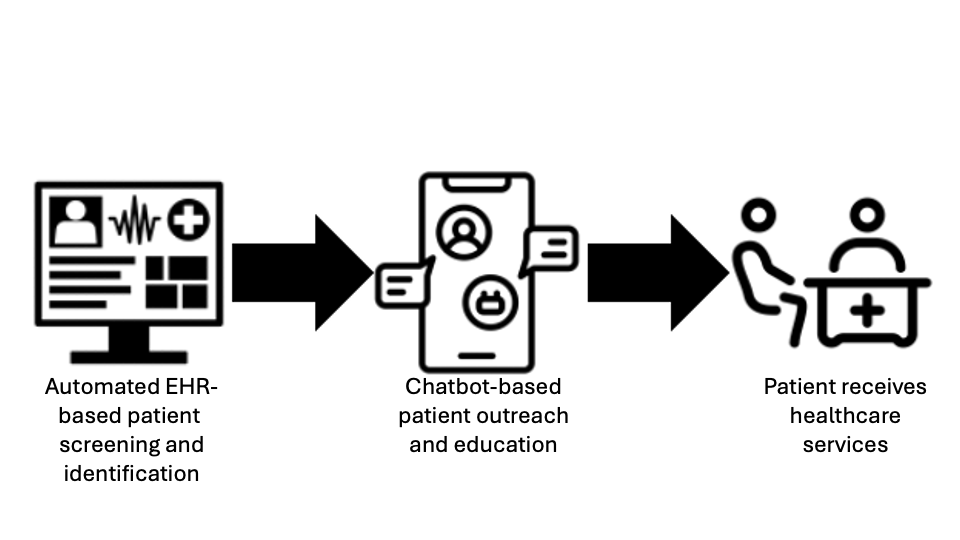

# Health System Leaders

## Executive summary—choosing GARDE for your health system and patients{-}

<ul style="margin:0; padding-left:30px; font-size:1.50rem; line-height:1.7; color:#333;">
<li style="margin-bottom:22px;">
GARDE is a population-based tool that automates the provision of healthcare services, like <a href="https://pubmed.ncbi.nlm.nih.gov/16144894/">US Preventive Services Task Force (USPSTF)-recommended cancer genetic testing</a>.
</li>

<li style="margin-bottom:22px;">
Healthcare systems can provide high quality care <em>without</em> adding to clinical workload.
</li>
</ul>

“Using GARDE helped our health system offer evidence-based cancer genetic testing and expert interpretation to our patients.”

— Medical Director for Quality, Division of Family and Community Medicine at an implementing site

<ul style="margin:0; padding-left:30px; font-size:1.50rem; line-height:1.7; color:#333;">
<li style="margin-bottom:22px;">
GARDE population health algorithms screen patients’ family histories in the electronic health record (EHR) to identify patients eligible for healthcare services, like genetic testing.
</li>

<li style="margin-bottom:22px;">
GARDE includes a chatbot authoring platform (<a href="https://garde.utah.edu/what-is-garde-chat.html">GARDE-Chat</a>) for patient outreach, education, and access to genetic testing.
</li>

<li style="margin-bottom:22px;">
Recommended healthcare can be facilitated and centrally managed by genetic counselors or other clinicians.
</li>

<li style="margin-bottom:0;">
GARDE can help your healthcare system identify and manage patients at high risk for hereditary cancer.
</li>
</ul>

## Why should we implement GARDE in our organization?{-}

  
  

    Figure 1. GARDE workflow.
  

GARDE supports cutting-edge research and offers novel and scalable care models for genetic testing. You can provide the innovative care that executive committees expect—including chatbot-based patient engagement and population-level genetic testing that supports precision health. GARDE helps you navigate the changing demands of healthcare.

In the U.S. in 2020, there were over 1.6M new cancer diagnoses and >600,000 people died of cancer. Genetic testing can identify individuals at high risk to develop cancer and provide them with personalized risk reduction strategies that may improve their lives and those of their families. [2.9 – 6.8%]((https://www.ncbi.nlm.nih.gov/pmc/articles/PMC9006693/)) of individuals screened by GARDE met criteria for genetic testing across three GARDE sites.

When used to identify patients at elevated risk to harbor a pathogenic variant in a hereditary cancer gene, implementing GARDE may help define a cancer center’s approach to meeting the [Commission on Cancer 2020](https://www.facs.org/quality-programs/cancer-programs/commission-on-cancer/standards-and-resources/2020/) Standard 4.4, Genetic Counseling and Risk Assessment.

Additional use cases can be found [here](https://garde.utah.edu/potential-use-cases.html).

## What problem does GARDE solve?{-}

Primary care clinicians want to provide the best care to patients, but struggle with the volume of care recommendations. Many physicians describe insufficient time and low self-efficacy with offering genetic testing. GARDE facilitates the provision of [guideline-concordant](https://www.nccn.org/guidelines/category_2) care through lower cost staff with genetics expertise and without involving primary care. This helps primary care clinicians provide high quality care without adding to their workload.

## What is the ROI of implementing GARDE?{-}

The GARDE software is open source and free. The GARDE team is funded by the National Cancer Institute to support its implementation through August 2028. We completed a formal budget impact analysis, which showed that the 3 year budget impact was a net positive of ~$57,000. This could be altered by a healthcare system's payer mix, the scale of implementation and cancer risk-reducing surgery uptake.

Our internal data suggests that technical implementation activities (i.e. relying on informaticist, information security, and EHR subject matter expert support) may require 25 – 30 person hours/month in the first 8 months (this is anticipated to decrease significantly after the first 8 months). 

[Research](https://pubmed.ncbi.nlm.nih.gov/38815190/) suggests that annual downstream revenue generated from patients without cancer who have previously been cared for at an academic medical center, were counseled by a genetic counselor and were found to have a pathogenic variant in a cancer-related gene is ~$492,000 USD.  The average annual wRVU was 724. Most of the increased clinical work of GARDE can be performed by non-physician clinicians.

## Can I trust GARDE? {-}  
Yes. GARDE was developed by a [seasoned](https://reimagineehr.utah.edu/about/) research team at the University of Utah (UofU) with funding from the National Cancer Institute. The National Cancer Institute [supported](https://reporter.nih.gov/search/TEzJm95cP0ek3AWz9g2Isw/project-details/9788088) a successful trial of GARDE at UofUHealth and New York University Langone, where it remains live. It is being implemented at Medical University of South Carolina and Weill Cornell Medicine. Research publications demonstrating GARDE’s implementations can be found [here](https://pubmed.ncbi.nlm.nih.gov/?term=CA204800&sort=date).

GARDE currently offers NCCN evidence-based criteria to identify patients eligible for genetic testing for hereditary cancer syndromes. [NCCN guidelines](https://www.nccn.org/guidelines/category_2) define high-quality cancer care and are widely used by third-party payors in determining commercial coverage policies.

## Will our patients’ data be leaving our organization? What protections are in place for the data transmitted?{-}

No, GARDE is designed to run within a healthcare system’s servers, so it doesn’t increase the risk of a security breach. There is no need for data use agreements.

## Is this another application that claims it’s out-of-the-box, but my staff won’t be able to use?{-}

  
  

    Figure 2. Out-of-the-box software that may not work.
  

Because GARDE uses industry-standard technologies and its code is open source, it can be adapted to fit your needs and workflows. With the GARDE team’s implementation support, organizations who deploy GARDE will be well established to continue its use. 

## How long will it take to implement GARDE?{-}

GARDE is highly customizable. The time necessary to implement GARDE will depend on a number of decisions the implementing site makes (see our [Governance Review information](file:///Users/acmadeo/University%20of%20Utah%20PHS/Kaphingst%20RA/GARDE/GIT/garde-courses/docs/garde-implementation.html), which describes some of the decisions that need to be considered when implementing GARDE.).

## How can I download this information?{-}

If you want to download this information, just click [here](resources/pdfs/Healthcare-system-leaders.pdf){target="_blank"} for a pdf!

