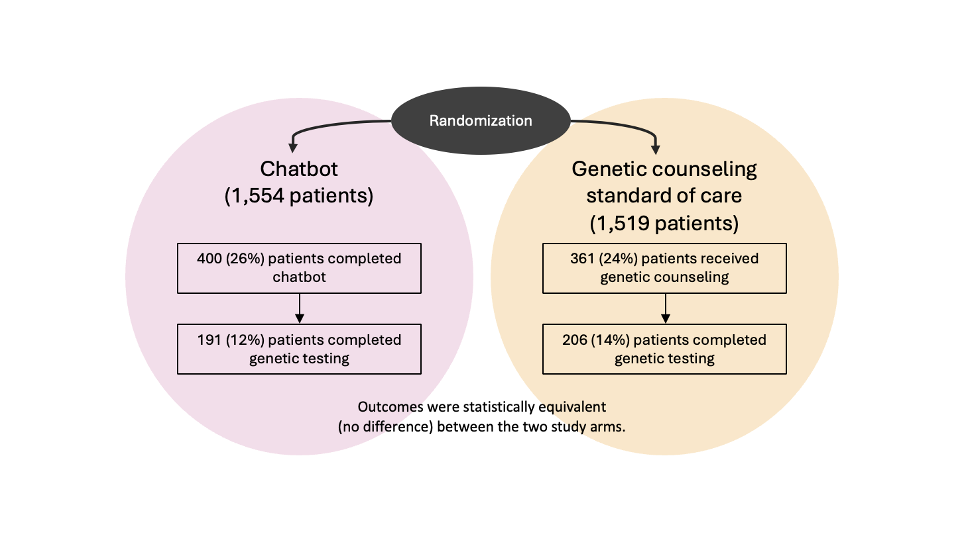

```{r setup, include=FALSE}
knitr::opts_chunk$set(echo = TRUE)
```

# Primary Care Line Leaders

<div style="border:2px solid #222; padding:18px 36px 30px 36px; margin-top:30px; margin-bottom:40px; background:#ffffff; box-sizing:border-box; display:flow-root;">

## Executive summary—GARDE, the primary care team, and primary care patients{-}

<ul style="margin:0; padding-left:30px; font-size:1.50rem; line-height:1.7; color:#333;">
<li style="margin-bottom:22px;">
GARDE is a population-based tool that automates the provision of healthcare services, like <a href="https://pubmed.ncbi.nlm.nih.gov/16144894/">US Preventive Services Task Force</a> (USPSTF)-recommended cancer genetic testing. This helps your team provide high quality care without adding to their workload.
</li>

<li style="margin-bottom:22px;">
GARDE population health algorithms screen patients’ family histories that clinicians have already collected in the electronic health record (EHR) to identify patients eligible for genetic testing. 
</li>
</ul>

<div style="float:right; width:34%; margin:12px 0 18px 30px; box-sizing:border-box;">
<div style="border-top:6px solid #000; padding-top:12px;">
<p style="margin:0; font-size:1.08rem; line-height:1.55; color:#333;">
“Using GARDE helped our health system offer evidence-based cancer genetic testing and expert interpretation to our patients.”
</p>
</div>

<p style="margin:12px 0; font-size:0.95rem; line-height:1.5; color:#333;">
— Medical Director for Quality, Division of Family and Community Medicine at an implementing site
</p>

<div style="border-bottom:6px solid #000;"></div>
</div>

<ul style="margin:0; padding-left:30px; font-size:1.50rem; line-height:1.7; color:#333;">
<li style="margin-bottom:22px;">
GARDE population health algorithms screen patients’ family histories in the electronic health record (EHR) to identify patients eligible for healthcare services, like genetic testing.
</li>

<li style="margin-bottom:22px;">
GARDE includes a chatbot authoring platform (<a href="https://garde.utah.edu/what-is-garde-chat.html">GARDE-Chat</a>) for patient outreach, education, and access to genetic testing.
</li>

<li style="margin-bottom:22px;">
Recommended healthcare can be facilitated and centrally managed by genetic counselors or other clinicians.
</li>

<li style="margin-bottom:0;">
Identifying an individual with hereditary breast and ovarian cancer (HBOC) or Lynch syndrome can have a significant health impact because those individuals are at increased risk (up to 61%) to develop a wide spectrum of cancers. Cancer risks can be managed through enhanced cancer screening and/or preventive surgeries.
</li>
</ul>

<div style="clear:both;"></div>
</div>

## What are some of the lifetime cancer risks associated with hereditary cancer syndromes?{-}

| Sex    | Cancer syndrome      | Cancer site | Lifetime Risk |
|---------|----------------------|-------------|---------------|
| Female | *BRCA1* or *BRCA2*   | Breast      | 45–65%        |
| Male   | *BRCA1* or *BRCA2*   | Prostate    | 7–61%         |
| Both   | *BRCA1* or *BRCA2*   | Pancreas    | 5–10%         |
| Both   | Lynch syndrome       | Colorectal  | 9–61%         |

## What if a patient’s family history in the EHR is incomplete?{-}

GARDE does not require a complete pedigree. A large number of eligible patients can be identified using available family history in the EHR. At four institutions that implemented GARDE, 29,301 out of 530,308 patients screened (~5.5%) were identified as eligible for genetic testing.

## How do patients pay for genetic testing?{-} 

For the vast majority of insured patients, the recommended genetic testing is a covered benefit and their out of pocket costs are typically &lt;$100. Patients with limited resources can apply for support through laboratory patient assistance programs. 

## Can I trust GARDE?{-}

GARDE was developed by an experienced biomedical informatics [research team](https://reimagineehr.utah.edu/about/) at University of Utah Health (UHealth) supported by the National Cancer Institute ([NCI, U24CA204800](https://reporter.nih.gov/search/s-tjWctxP0u_iwQv34ifCQ/projects)). NCI supported a successful trial of GARDE at UHealth and New York University Langone Health ([U01CA232826](https://reporter.nih.gov/search/I81ODqGkp0K4ArwneSAX1Q/projects)). With NCI support ([U24CA274582](https://reporter.nih.gov/search/AV4AUvA6Z0Sh_LxXWMpV3A/projects)), GARDE is being implemented at Medical University of South Carolina and Weill Cornell Medicine. Peer-reviewed publications about GARDE can be found [here](https://pubmed.ncbi.nlm.nih.gov/?term=CA204800&sort=date).

## Can GARDE address other research questions or clinical needs?{-}
GARDE can be used in both research and clinical settings. Additional use cases can be found [here](file:///Users/acmadeo/University%20of%20Utah%20PHS/Kaphingst%20RA/GARDE/GIT/garde-courses/docs/potential-use-cases.html). 

## How many patients are likely to receive genetic testing through GARDE?{-}

The below figure provides study outcomes of the BRIDGE trial at UofU Health and NYU Langone. 

<div style="text-align:center; margin:20px 0 30px 0;">

  

  <p style="font-size:0.8em; line-height:1.4; max-width:700px; margin:10px auto 0 auto; text-align:left;">
    <strong>Figure 1.</strong> Uptake of Cancer Genetic Services BRIDGE study flow. Adapted from:
    Kaphingst KA, Kohlmann WK, Lorenz Chambers R, et al.
    <em>Uptake of Cancer Genetic Services for Chatbot vs Standard-of-Care Delivery Models: The BRIDGE Randomized Clinical Trial.</em>
    JAMA Netw Open. 2024. PMID: 39250153; PMCID:
    <a href="https://pmc.ncbi.nlm.nih.gov/articles/PMC11385050/">PMC11385050</a>.
  </p>

</div>

## I have other questions about GARDE. Is there somebody I can speak with?{-}

[The GARDE study team](mailto:GARDE@hci.utah.edu) can be emailed directly and can provide you with references from implementing sites.


