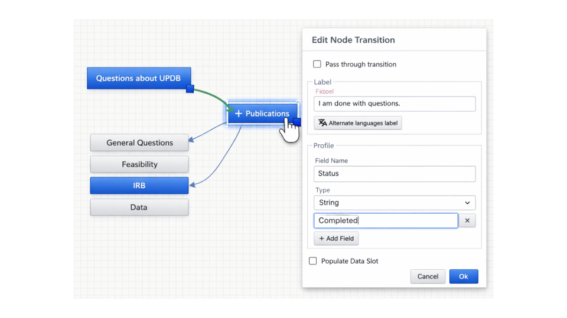
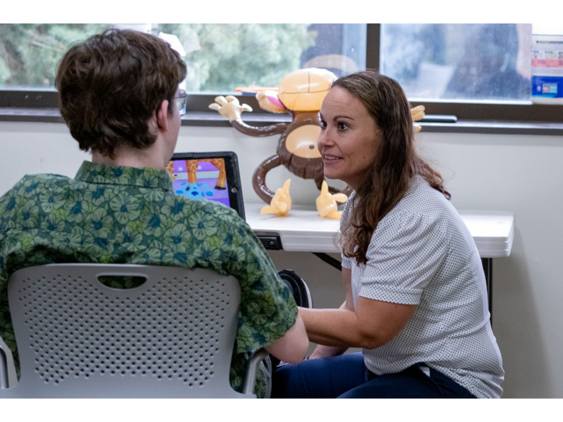
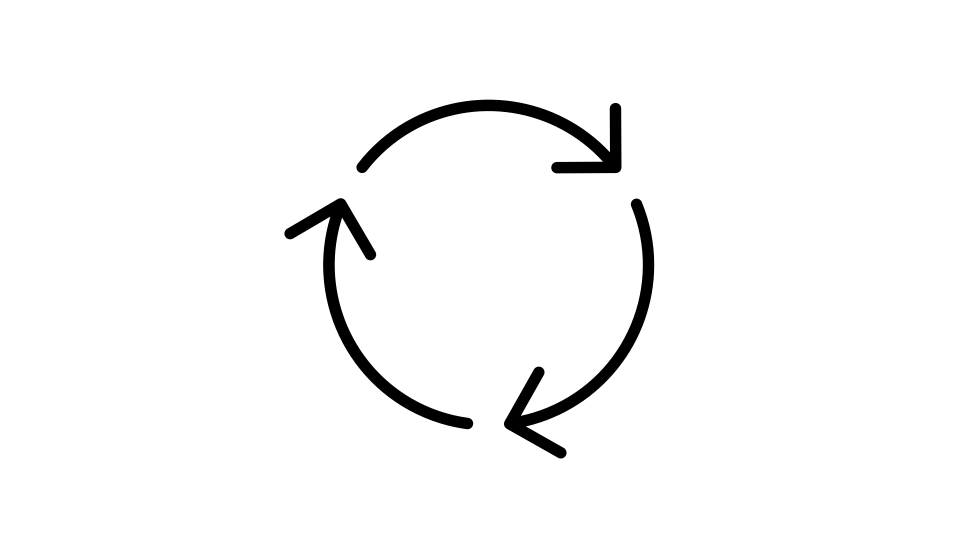
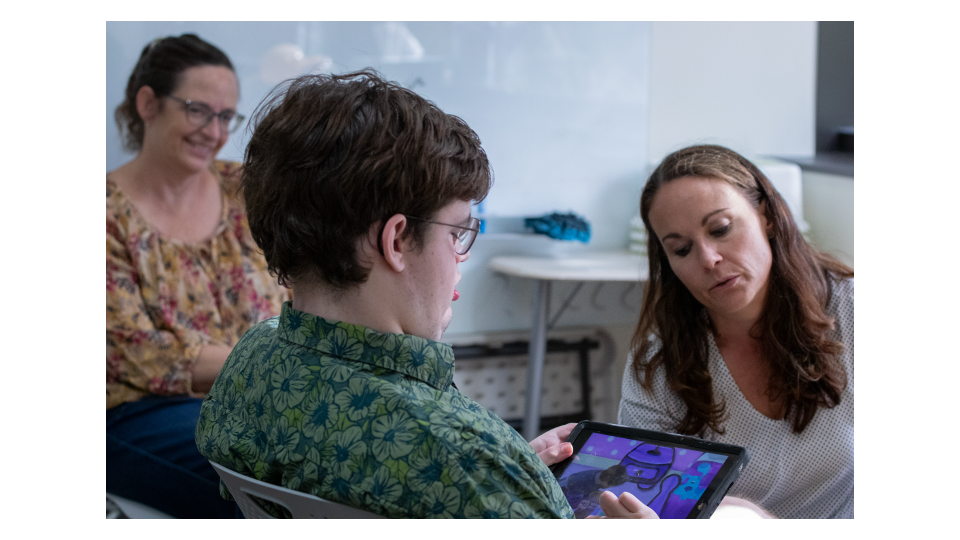
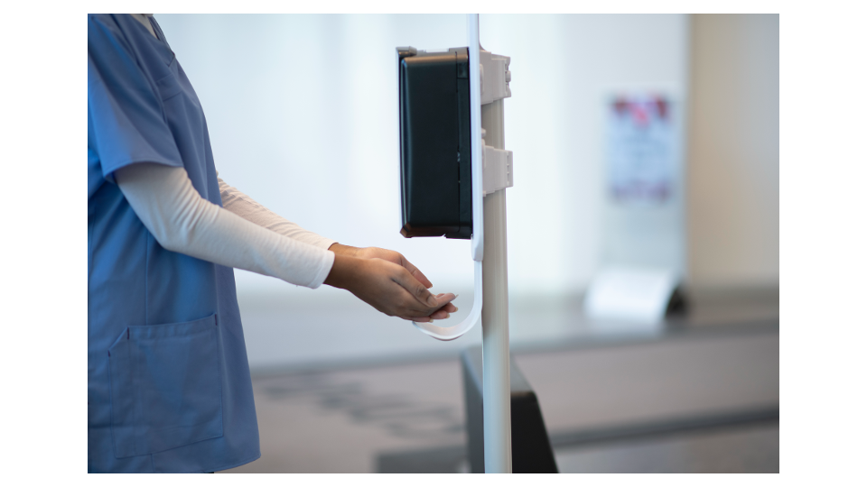

# GARDE-Chat

GARDE-Chat is a scalable, open-source platform that can be used by people without any programming skills to create fully scripted, large language model (LLM) enabled, and hybrid chatbots (conversational agents). GARDE-Chat chatbots can be designed to deliver health education, patient engagement, and access to healthcare services to patients. It is available through an open-source, free license. 

## What problem does GARDE-Chat solve?

GARDE-Chat facilitates the development of chatbot-based interventions without requiring extensive training or programming skills through a drag-and-drop graphical user interface. Chatbots can be shared by researchers and institutions so that chatbots can be developed collaboratively across use cases. GARDE-Chat supports chatbot-based interventions in a variety of study designs, from small pilot/feasibility studies to large pragmatic clinical trials. It integrates with external applications and data sources such as electronic health records and REDCap. Chatbots developed with GARDE-Chat can be delivered via web browsers or text messaging. A detailed audit log supports the analyses of chatbot-user interactions.

## How does GARDE-Chat ensure that chatbots are accurate and have safety guardrails?

Two major concerns when using AI chatbots are “hallucinations” (i.e., a chatbot provides inaccurate/fabricated information) and a chatbot providing information that is beyond its desired scope (e.g., providing medical advice even when it was prompted not to do so). GARDE-Chat offers different approaches to address these concerns: 
1.	GARDE-Chat allows researchers to develop rule-based/scripted chatbots that do not use AI or limit AI to specific sections of the chatbot. A rule-based chatbot has predefined options with a fixed set of possible questions and responses that are fully scripted by humans. This alternative offers consistency, predictability, accuracy, and tight guardrails. A hybrid approach includes core scripted content with limited opportunities to ask questions to an LLM. GARDE-Chat provides support for fully scripted, LLM-based and hybrid chatbots. 
2.	GARDE-Chat interfaces with LLMs via an application programming interface (API). As such, end users always interact with LLMs via the GARDE-Chat user interface, constrained by prompts designed by the chatbot authors, and never with the LLMs directly.
3.	Optimal prompt engineering techniques, such as retrieval augmented generation (RAG), have been shown to significantly reduce the risk of hallucinations.
4.	GARDE-Chat provides a dashboard that allows continuous, real-time monitoring of user interactions with chatbots to help identify potential problems.

## My institution is very concerned with privacy. How can GARDE-Chat address this concern?

GARDE-Chat addresses participant privacy in a few ways:
1.	Rule-based/scripted chatbots can run on HIPAA-compliant servers located within the premises of an institution, with patient data never leaving those premises to external servers. Unlike LLMs, rule-based chatbots run on low-cost servers that do not require high performance computational infrastructure with powerful graphical processing units (GPUs).
2.	GARDE-Chat is integrated with open-source LLMs that can be deployed on HIPAA-compliant servers within the premises of an institution, so that participant information is never sent to external LLM servers. Several academic medical centers already provide such an infrastructure to researchers.
3.	Several academic medical centers have also established business associate agreements with LLM vendors such as OpenAI and Google to access their cloud-hosted LLMs (e.g., ChatGPT, Gemini) in HIPAA-compliant environments that are not shared with other institutions and do not use the data for LLM training. 

## Is GARDE-Chat secure?

GARDE-Chat was developed by a [seasoned](https://reimagineehr.utah.edu/about/) research team at the University of Utah with funding from the National Cancer Institute and other sources. The software has received security clearance at the UofU and other sites and has been used to support several large pragmatic trials with up to 30,000 participants. GARDE-Chat is being used in research studies at several academic medical centers, including Medical University of South Carolina, Wake Forest University School of Medicine, and Weill Cornell Medicine. Research that relied on GARDE-Chat is described [here](https://pmc.ncbi.nlm.nih.gov/articles/PMC12798686/#ocaf211-T1).

## Build Research-Ready Health Chatbots Without Programming Skills {-}

<!-- LEFT SIDE: IMAGE BOX -->  

    

      
      
      
    

  

<!-- RIGHT SIDE: TEXT -->  

    

GARDE-Chat is an open-source platform for creating fully scripted, AI-enabled, and hybrid chatbots for healthcare and clinical research. Designed for researchers, clinicians, and healthcare organizations, GARDE-Chat makes it possible to build and deploy conversational experiences through a visual drag-and-drop interface — without requiring advanced programming skills.  

## GARDE-Chat use cases {-}

<strong>Health Education</strong>

<strong>Patient Engagement</strong>

<strong>Clinical Research Recruitment and Retention</strong>

<strong>Symptom Monitoring and Follow-Up</strong>

<strong>Access to Healthcare Services</strong>

<strong>Behavioral and Lifestyle Interventions</strong>

Chatbots created with GARDE-Chat can be delivered through web browsers or SMS/text messaging.

## Advantages of GARDE-Chat{-}
### No-Code Chatbot Development {-}

GARDE-Chat allows non-programmers to design chatbot workflows using a visual interface instead of custom code. Researchers and institutions can collaborate by sharing chatbot designs and adapting them across studies and populations.

GARDE-Chat allows non-programmers to design chatbot workflows using a visual interface instead of custom code. Researchers and institutions can collaborate by sharing chatbot designs and adapting them across studies and populations.

### Flexible Approaches {-}

#### GARDE-Chat supports the following types of chatbots{-}

<h4 style="margin-top:0; margin-bottom:12px;">Scripted</h4>

Fixed conversation flows 
Predictable responses 
High consistency

<h4 style="margin-top:0; margin-bottom:12px;">Hybrid</h4>

Mix of scripted content and AI 
Balanced flexibility 
Controlled responses

<h4 style="margin-top:0; margin-bottom:12px;">LLM-enabled</h4>

More open-ended AI conversation 
Uses large language models 
Natural language interaction

This flexibility allows teams to balance consistency, scalability, and conversational flexibility based on the needs of a project.

### Designed for Research and Clinical Studies {-}

<table style="width:100%; border-collapse:collapse; margin-top:20px;">
<tr>

<td style="width:52%; vertical-align:middle; padding-right:30px;">

GARDE-Chat supports a wide range of study designs, from pilot studies to large pragmatic clinical trials. The platform includes:

- Detailed audit logs of chatbot-user interactions
- Integration with external systems and data sources
- Support for longitudinal and multi-step interventions

GARDE-Chat can integrate with varied systems, including:

- Electronic health records (EHRs)
- REDCap
- Other research and clinical data systems

</td>

<td style="width:48%; vertical-align:middle; text-align:center;">

</td>

</tr>
</table>

### Accuracy, Safety, and Guardrails {-}

<table style="width:100%; border-collapse:collapse; margin-top:20px;">
<tr>

<td style="width:45%; vertical-align:top; padding-right:30px;">

Healthcare organizations and researchers often have concerns about AI-generated misinformation, hallucinations, and unintended medical advice.

GARDE-Chat includes the following approaches, which support safer and more controlled chatbot experiences.

</td>

<td style="width:55%; vertical-align:middle;">

</td>

</tr>
</table>

#### Scripted and Hybrid Workflows {-}

Teams can create fully scripted chatbots with fixed questions and responses, reducing variability and helping ensure consistency and accuracy.

Hybrid chatbot designs allow organizations to keep core educational or clinical content fully scripted while limiting where AI-generated responses are used.

#### Controlled Access to LLMs {-}

When large language models are used, participants interact with the chatbot through the GARDE-Chat interface rather than directly with the model itself. Researchers can configure prompts, workflows, and constraints to help guide chatbot behavior.

#### Retrieval-Augmented Generation (RAG) {-}

RAG can help ground responses in approved source material and reduce the likelihood of inaccurate or fabricated answers.

#### Monitoring and Oversight {-}

GARDE-Chat includes dashboards and audit logs that allow research teams to review chatbot interactions and monitor chatbot performance over time.

### Privacy and Data Protection {-}

<table style="width:100%; border-collapse:collapse; margin-top:20px;">
<tr>

<td style="width:52%; vertical-align:middle; padding-right:40px;">

</td>

<td style="width:48%; vertical-align:middle;">

GARDE-Chat was designed with healthcare and research privacy requirements in mind.

</td>

</tr>
</table>

#### On-Premise Deployment Options {-}

Scripted chatbots can be deployed on HIPAA-compliant institutional infrastructure, allowing participant data to remain within the organization's environment.

#### Support for Self-Hosted Open-Source Models {-}

GARDE-Chat can integrate with open-source large language models that are deployed within an institution's own secure infrastructure.

#### Compatibility with Enterprise LLM Environments {-}

Some institutions maintain HIPAA-compliant agreements and environments for commercial LLM providers such as OpenAI or Google. GARDE-Chat can be configured to work within those institutional environments when available.

Institutional privacy, security, and compliance requirements vary, and organizations should evaluate deployment configurations based on their own policies and regulatory obligations.

### Security and Real-World Use {-}

GARDE-Chat was developed by [researchers at the University of Utah](https://reimagineehr.utah.edu/about/) with support from the National Cancer Institute and other funding sources.

The platform has been used in [multiple research studies and pragmatic clinical trials](https://pmc.ncbi.nlm.nih.gov/articles/PMC12798686/#ocaf211-T1), including studies involving large participant populations.

GARDE-Chat has also been used in research collaborations involving institutions such as:

- University of Utah
- Medical University of South Carolina
- Wake Forest University School of Medicine
- Weill Cornell Medicine

### Open Source and Available to Researchers {-}

<table style="width:100%; border-collapse:collapse; margin-top:20px;">
<tr>

<td style="width:42%; vertical-align:middle; padding-right:30px;">

GARDE-Chat is available under an open-source license, allowing researchers and institutions to adapt and extend the platform for their own healthcare and research applications.

</td>

<td style="width:58%; vertical-align:middle; text-align:center;">

</td>

</tr>
</table>

## Contact information {-}

For additional information or collaboration opportunities, [email the GARDE team](mailto:GARDE@hci.utah.edu).

