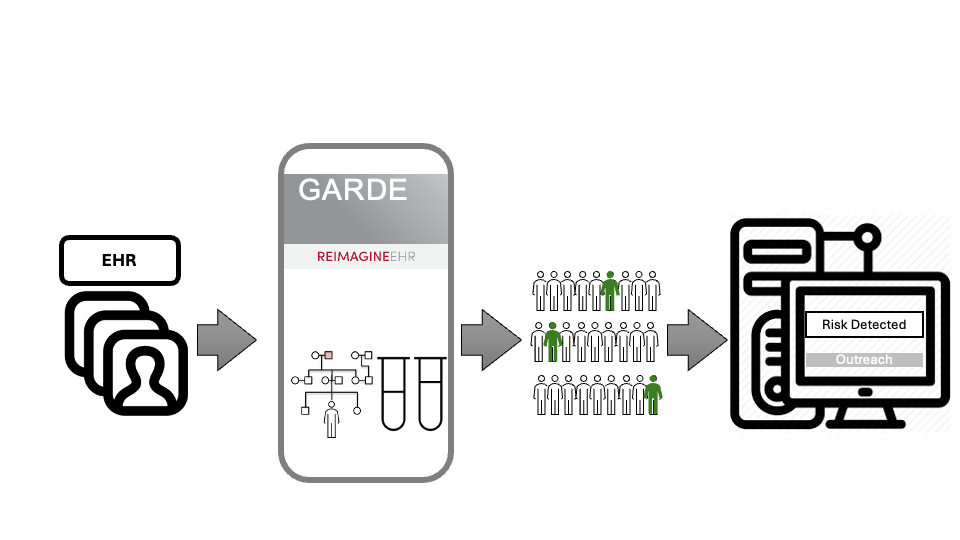
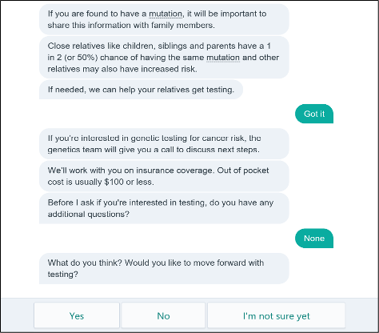

```{r, include = FALSE}
```
# What is GARDE?

GARDE is an open-source digital health software platform, funded by several grants from
the National Cancer Institute. GARDE enables population-level risk
assessment for health conditions with chatbot-based outreach and education.

GARDE has two components:
  
  1.   **population-level risk assessment algorithms** that analyze patient data in the electronic
health record (EHR) to identify patients who meet criteria for health services (Figure 1); and

<figure>
  
  <figcaption><p>Figure 1. GARDE workflow.</p></figcaption>
  </figure>
  
  2.   a **chatbot** authoring platform (GARDE-Chat) that allows researchers and their teams to create healthcare chatbots for patient outreach, pretest
education, and access to genetic testing (Figure 2).

<figure>
  
  <figcaption><p>Figure 2. Chatbot example.</p></figcaption>
  </figure>
  
  GARDE algorithms and GARDE-Chat chatbots are EHR and healthcare system-agnostic. They can be used in various clinical settings. GARDE algorithms have been deployed across 6 academic medical centers. Over 20 studies use GARDE-Chat across various clinical domains and settings, from 
[pilot trials to large pragmatic clinical trials](https://pmc.ncbi.nlm.nih.gov/articles/PMC1279866/). GARDE algorithms and GARDE-Chat chatbots can be shared and adapted across research projects and institutions. GARDE algorithms and GARDE-Chat chatbots can be used independently or in combination depending on the study design and implementation approach.


